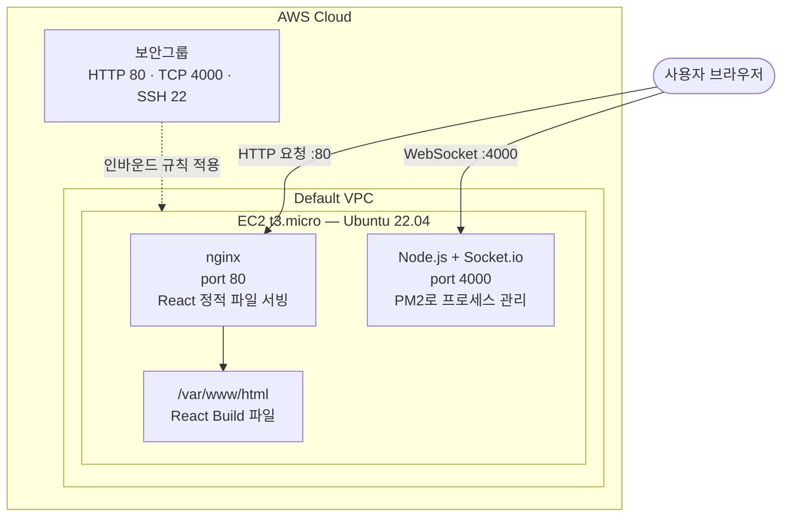
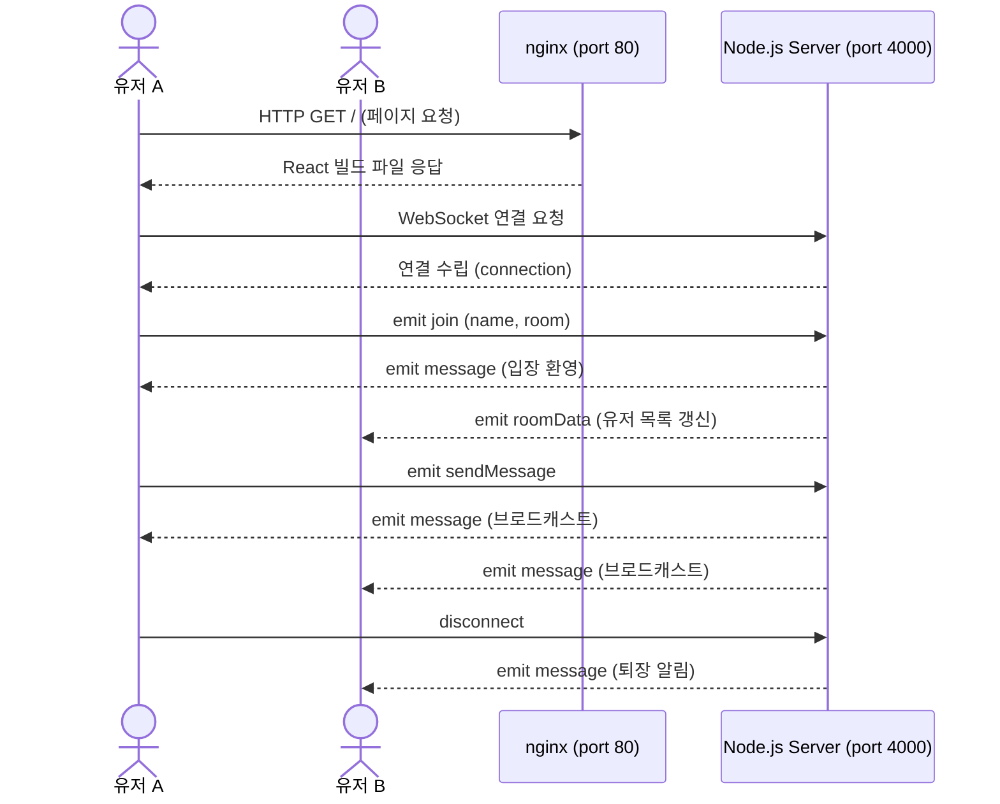
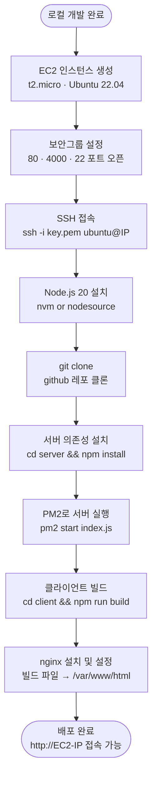

# React + Node.js

(1) 서버 실행

```bash
cd /server
node index.js //port:4000
```

(2) 클라이언트 실행

```bash
cd /client
npm run start
```

# 다이어그램들

## 시스템 아키텍처

인프라 전체 구조 : `AWS`, `EC2`, `nginx`, `PM2`



## 시퀀스 다이어그램

실시간 채팅 흐름: `WebSocket`, `Socket.io`, `실시간 통신`



## 배포 플로우차트

배포 과정 전체: `CI/CD 없는 수동 배포`


